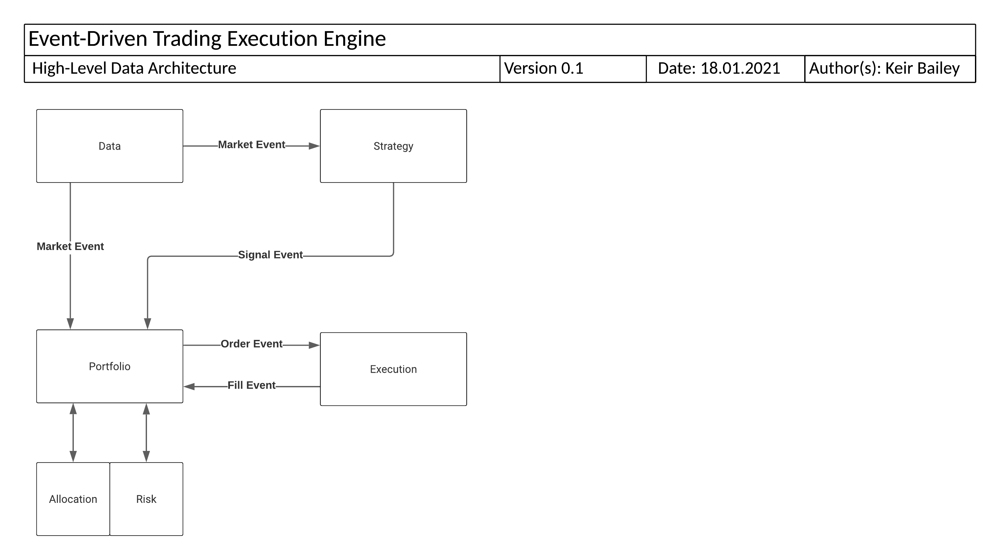

# barter-rs
Rust library containing high-performance, modular trading engine & back-testing components.

## Todo Features:
- 'Statistics' portfolio component that keeps running totals of important stats - expose via api?
- Add latency, fees etc to the SimulatedExecution handler for increased realism.

## Tech Debt:
1. Clean up serde parser w/ extracted methods, testing, cleaner solution, etc
2. Should I add a logger for internal lib logging? Or just useful errors?
3. Impl sugar methods for builders to allow passing &str instead of just String
